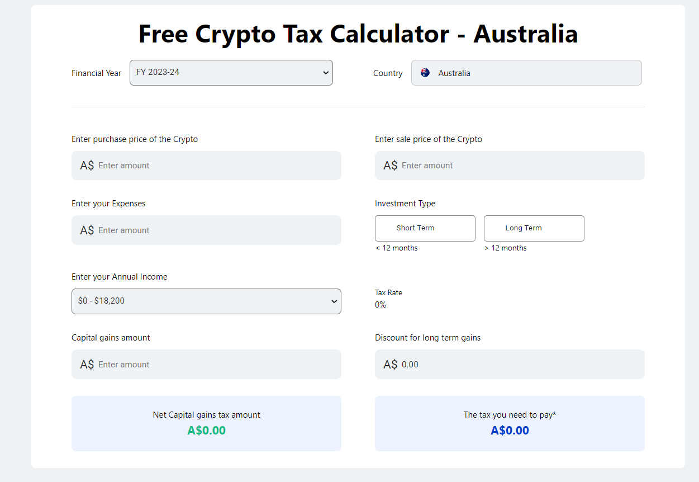
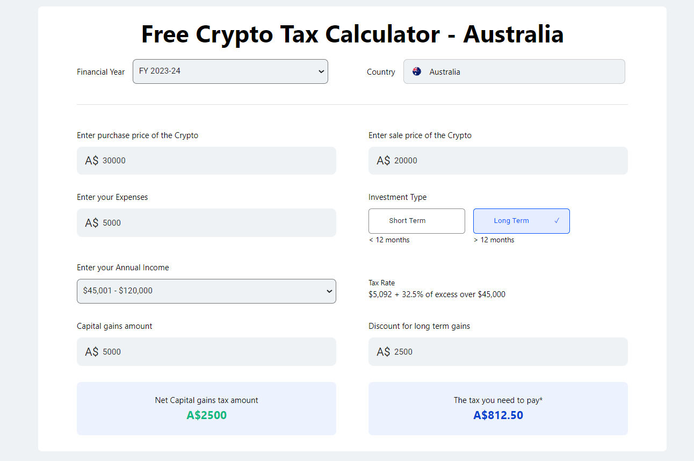

## Hosted link 👇

[Free Crypto Tax Calculator ](https://free-tax-calculator-ugam.netlify.app/ "Free Crypto Tax Calculator Link")

# Free Crypto Tax Calculator - Australia

## Overview

The Free Crypto Tax Calculator is a web application designed to help users in Australia calculate their cryptocurrency tax liabilities. The application allows users to input purchase and sale prices, expenses, and determine if their investment is short-term or long-term. Based on this information, it calculates the net capital gains and the tax payable. This project is built using React, with custom components for handling various inputs and tax calculations.

## Components

### 1. **Crypto Component**

- The main component that ties all the functionality together.
- Manages the state for purchase price, sale price, expenses, investment type (short-term or long-term), profit, tax payable, and net capital.
- Handles input changes and updates the calculations accordingly.

### 2. **Dropdown Component**

- A reusable dropdown component for selecting the country.

### 3. **InvestMentType Component**

- Allows users to select the investment type (short-term or long-term).
- Updates the parent component with the selected investment type.

### 4. **AnnualUncomeTax Component**

- Allows users to input their annual income tax percentage.
- Updates the parent component with the tax percentage.

### 5. **CapitalDiscountLongTerm Component**

- Calculates the net capital based on whether the investment is short-term or long-term.
- Updates the parent component with the calculated net capital.

## Functionalities

- **Purchase Price Input:** Users can enter the purchase price of the cryptocurrency.
- **Sale Price Input:** Users can enter the sale price of the cryptocurrency.
- **Expenses Input:** Users can enter any expenses related to the transaction.
- **Investment Type:** Users can select whether the investment is short-term or long-term.
- **Annual Income Tax:** Users can input their annual income tax percentage.
- **Net Capital Calculation:** Automatically calculates the net capital based on the provided inputs and investment type.
- **Tax Payable Calculation:** Calculates the tax payable based on the net capital and the tax percentage.

## Packages Used

- **React:** A JavaScript library for building user interfaces.
- **react-icons:** For including icons in the application.

## Learning from the Project

- **React and Hooks:** Gained deeper understanding of React hooks (`useState`, `useEffect`) for managing state and side effects.
- **Component Design:** Learned how to design and structure reusable components in React.
- **State Management:** Improved skills in managing and updating component state based on user inputs.
- **Conditional Rendering:** Enhanced ability to conditionally render components based on state.

## Future Improvements

- **Improved UI/UX:** Enhance the user interface and experience with better styling and interactive elements.
- **Validation:** Add input validation to ensure that all fields are filled out correctly.
- **Multiple Financial Years:** Allow users to select different financial years for tax calculations.
- **More Countries:** Expand the country selection to include more countries with their respective tax rules.
- **Currency Conversion:** Implement currency conversion for users dealing with multiple currencies.
- **Detailed Reports:** Provide detailed tax reports that users can download or print.
