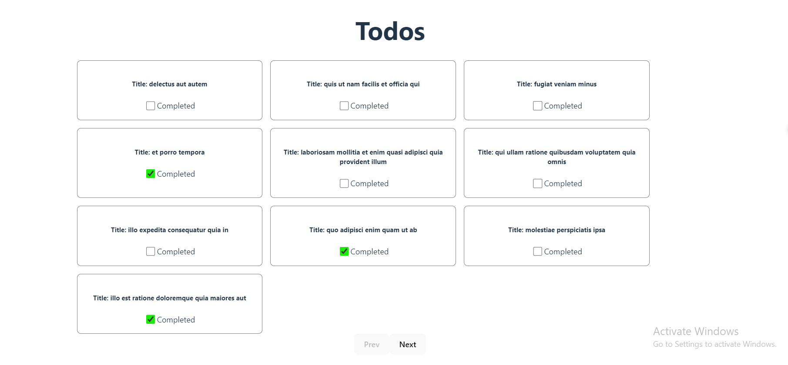
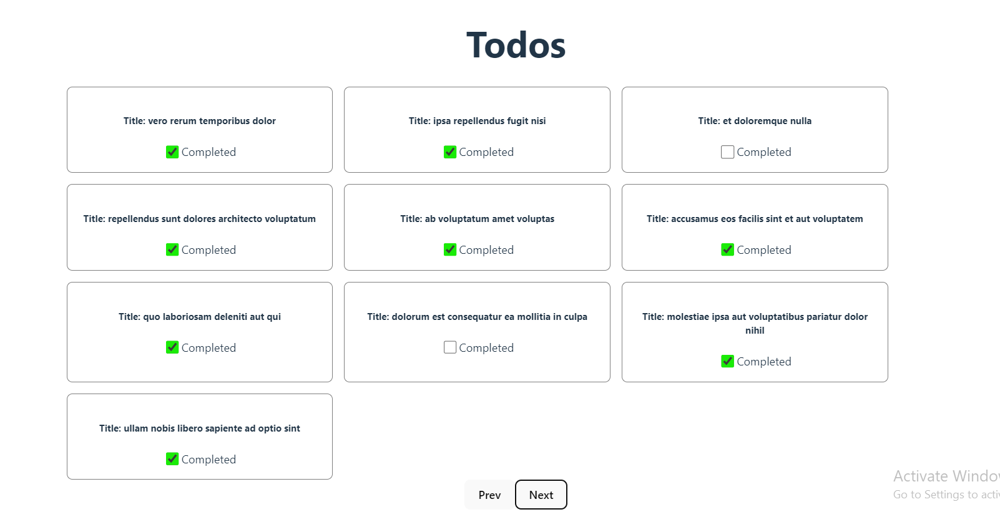

## Hosted Link 👇

[Data Retrive From URL](https://data-retrive-url-ugam.netlify.app/ "Data retrive")

# Todo Application





## Overview

This project is a simple Todo application built using React. It fetches data from a JSON placeholder API and displays a list of tasks. Users can paginate through the tasks, and update the completion status of each task. The application leverages caching to optimize performance and reduce unnecessary API calls.

## Functionalities

1. **Data Fetching:** Fetches data from the JSON placeholder API with pagination.
2. **Caching:** Caches the fetched data to reduce unnecessary API calls.
3. **Update Task Status:** Allows users to update the completion status of tasks.
4. **Pagination:** Allows users to navigate through the tasks in pages.

## React Hooks Used

1. **useState:** Manages state for data, caching, and pagination.
2. **useEffect:** Handles side effects such as data fetching and updating the component when the page changes.
3. **useRef:** Used for caching the fetched data.
4. **useCallback:** Optimizes the `getDtata` function to prevent unnecessary re-renders.

## Extra Packages Used

1. **axios:** For making HTTP requests to fetch and update data.

## Learning from the Project

- Improved understanding of React hooks such as `useState`, `useEffect`, `useRef`, and `useCallback`.
- Learned how to implement caching in a React application to optimize performance.
- Gained experience in handling asynchronous operations and updating state based on API responses.

## Future Improvements

1. **Error Handling:** Improve error handling to provide better user feedback in case of API failures.
2. **UI/UX Enhancements:** Enhance the UI for a better user experience, including better pagination controls and task management.
3. **Testing:** Add unit and integration tests to ensure the reliability of the application.
4. **Performance Optimization:** Further optimize the application for performance, especially for larger datasets.

## Setup and Installation

1. Clone the repository:
   ```sh
   git clone https://github.com/yourusername/todo-app.git
   ```
2. Navigate to the project directory:
   ```sh
   cd todo-app
   ```
3. Install the dependencies:
   ```sh
   npm install
   ```
4. Run the application:
   ```sh
   npm start
   ```

## Conclusion

This Todo application serves as a practical example of using React for building dynamic web applications with data fetching, caching, and state management. The project showcases the use of various React hooks and demonstrates how to handle asynchronous operations in a React environmen

This template provides a minimal setup to get React working in Vite with HMR and some ESLint rules.
