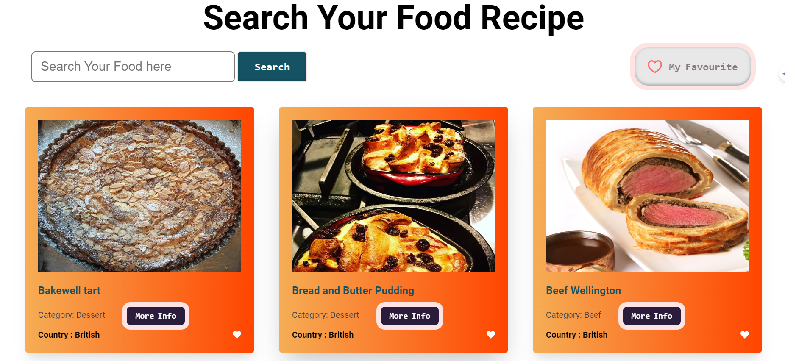
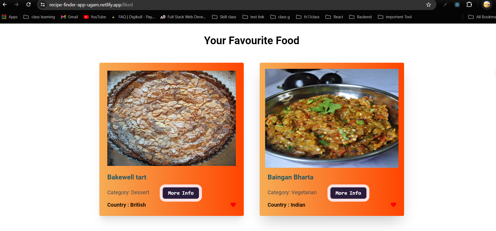
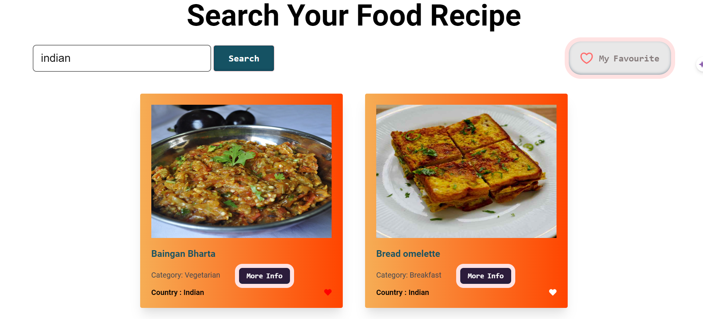
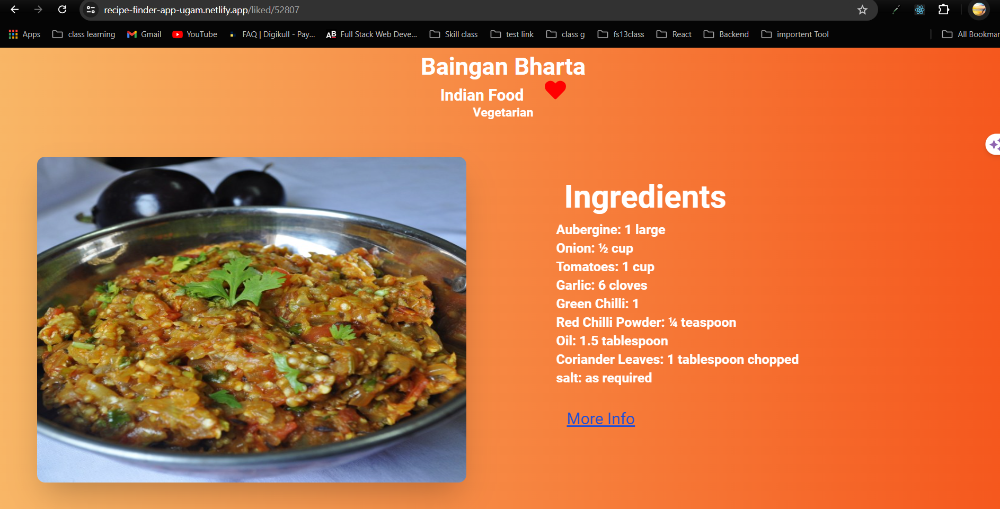

## Hosted Link 👇

[Recipe Finder Application](https://recipe-finder-app-ugam.netlify.app/ "Recipe Finder")

## Components

### 1. **App Component**

- The main entry point of the application.
- Sets up routing for different pages using `BrowserRouter`, `Routes`, and `Route`.

### 2. **Foods Component**

- Displays a list of available meals fetched from TheMealDB API.
- Provides navigation links to view detailed information about each meal.

### 3. **MealInfo Component**

- Fetches and displays detailed information about a selected meal.
- Shows meal title, category, area, ingredients, and instructions.
- Allows users to like/unlike meals using a heart icon.

### 4. **Favourite Component**

- Displays a list of meals that the user has liked.
- Allows navigation to view detailed information about each liked meal.

### 5. **RecipeContext**

- Provides context for managing liked meals.
- Includes methods for updating liked meals and retrieving liked meals from local storage or state.

## Functionalities

- **Meal Browsing:** Users can browse through a list of meals.
- **Meal Details:** Users can view detailed information about a selected meal, including ingredients and instructions.
- **Liking Meals:** Users can like or unlike meals. Liked meals are stored and can be viewed later.
- **Routing:** The application uses React Router for navigating between different pages.

## Packages Used

- **react:** A JavaScript library for building user interfaces.
- **react-router-dom:** For routing and navigation within the application.
- **axios:** For making HTTP requests to fetch meal data from TheMealDB API.
- **react-icons:** For including icons in the application (e.g., heart icon for liking meals).

## Learning from the Project

- **React and Hooks:** Gained deeper understanding of React hooks (`useState`, `useEffect`) for managing state and side effects.
- **React Router:** Learned how to implement client-side routing using React Router.
- **API Integration:** Improved skills in integrating third-party APIs using Axios.
- **Context API:** Learned how to use React Context for state management across multiple components.
- **CSS Styling:** Enhanced skills in styling components using CSS.

## Future Improvements

- **Improved UI/UX:** Enhance the user interface and experience with better styling and interactive elements.
- **Search Functionality:** Add a search feature to allow users to search for meals by name or category.
- **Advanced Filtering:** Implement filtering options to sort meals by area, category, or ingredients.
- **Pagination:** Implement pagination for browsing meals to handle large datasets efficiently.
- **User Authentication:** Add user authentication to enable personalized meal recommendations and liked meals stored per user.
