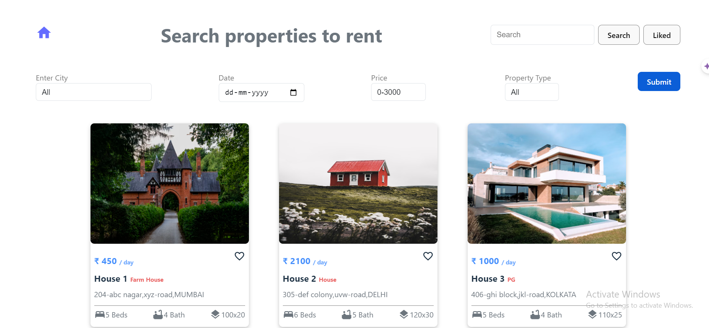
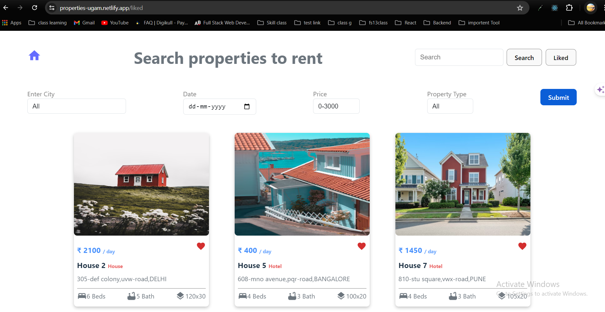
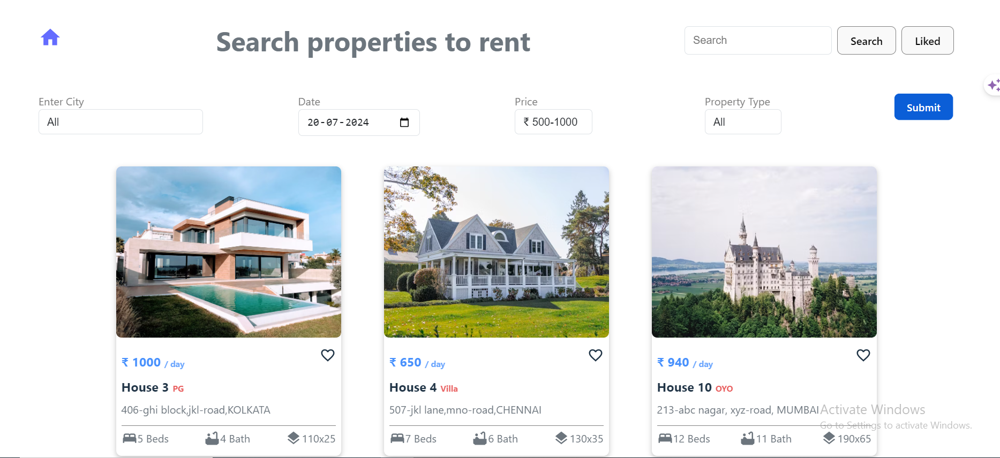

## Hosted Link 👇

[Search Properties Link](https://properties-ugam.netlify.app/)

# Reunion

## Overview

The Accommodation Management Application is a web-based platform designed to help users manage and explore various accommodations. It allows users to view a list of available accommodations, search for specific properties, and manage liked accommodations. The application is built using React and includes routing, context for state management, and several reusable components.

## Functionalities

- **View Accommodations:** Users can view a list of all available accommodations with their basic details.
- **Search:** Users can search for accommodations by name or other criteria.
- **View Liked Accommodations:** Users can view a list of accommodations they have liked.
- **Like/Unlike Accommodations:** Users can like or unlike accommodations to manage their favorite properties.

## React Hooks

- **useState:** Used for managing local component state such as search input and liked accommodations.
- **useEffect:** Used for performing side effects such as fetching data or updating state based on dependencies.
- **useContext:** Used for accessing global state and functions provided by the context.

## Packages Used

- **React:** A JavaScript library for building user interfaces.
- **react-router-dom:** For routing and navigation within the application.
- **React Icons:** For including icons in the application.
- **Axios:** For making HTTP requests (if needed for future data fetching).

## Learning from the Project

- **React and Context API:** Gained a deeper understanding of managing global state using the Context API in React.
- **Routing:** Improved skills in implementing client-side routing using React Router.
- **Component Design:** Learned how to design and structure reusable components in React.
- **State Management:** Enhanced ability to manage and update component state based on user inputs and actions.

## Future Improvements

- **Improved UI/UX:** Enhance the user interface and experience with better styling and interactive elements.
- **Validation:** Add input validation to ensure that all fields are filled out correctly.
- **Pagination:** Implement pagination for browsing accommodations to handle large datasets efficiently.
- **Detailed Property Information:** Provide detailed information about each accommodation, including images and reviews.
- **User Authentication:** Add user authentication to enable personalized accommodation management and secure access.
