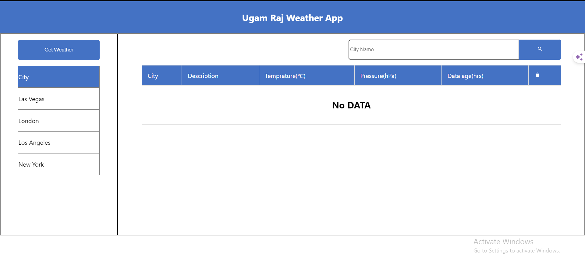
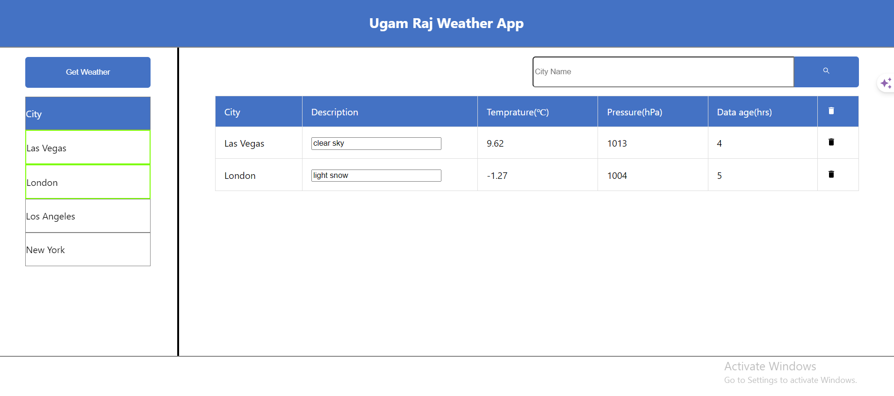
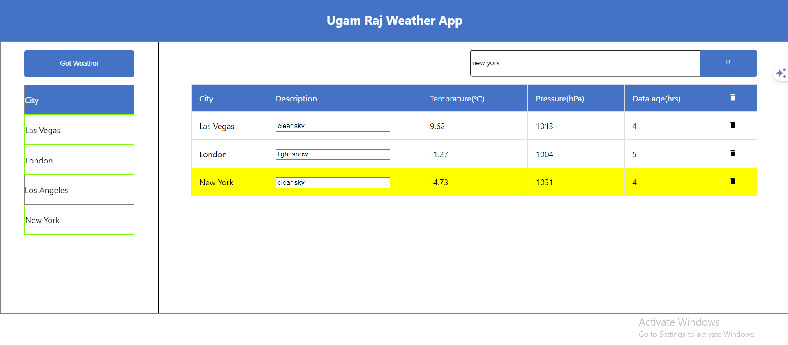

## Hosted Link 👇

[Weather app](https://weather-app-ugam.netlify.app/ "weather app link")

# Weather Application

## Overview

The Weather Application is a web-based platform designed to provide weather information for various cities. The application allows users to fetch and display weather data for a list of predefined cities. The application is built using React and includes state management, API integration, and reusable components.

## Functionalities

- **View Weather Data:** Users can view weather information for a list of predefined cities.
- **Select City:** Users can select a city from the sidebar to fetch and display its weather data.
- **API Integration:** Fetches weather data from an external API.

## React Hooks

- **useState:** Used for managing local component state such as the list of cities, selected city, and weather data.
- **useEffect:** Used for performing side effects such as fetching data when the component mounts or updates.

## Packages Used

- **React:** A JavaScript library for building user interfaces.
- **Axios:** For making HTTP requests to fetch weather data from the API.

## Learning from the Project

- **React State Management:** Gained a deeper understanding of managing local state using the `useState` hook.
- **API Integration:** Learned how to integrate third-party APIs using Axios for data fetching.
- **Component Design:** Improved skills in designing and structuring reusable components in React.
- **Conditional Rendering:** Enhanced ability to conditionally render components based on state changes.

## Future Improvements

- **Improved UI/UX:** Enhance the user interface and experience with better styling and interactive elements.
- **Add More Cities:** Allow users to add more cities dynamically instead of being limited to predefined cities.
- **Error Handling:** Implement better error handling for API requests and user inputs.
- **Detailed Weather Information:** Provide more detailed weather information such as wind speed, precipitation, and forecasts.
- **Search Functionality:** Add a search functionality to allow users to search for any city and fetch its weather data.
